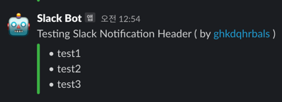

# Slack Send List GitHub Action

Send list of data into Slack in easy way

## Setup variables

```yaml
- name: Send GitHub Action trigger data to Slack workflow
  uses: ghkdqhrbals/slack-list@v1.0.12
  with:
    slack-webhook-url: ${{ secrets.SLACK_WEBHOOK_URL }}
    actor: ${{ github.actor }}
    messages: '["test1", "test2", "test3"]' # json string list syntax
    message-title: 'Testing Slack Notification Header'
    color: '#3bb143' # set color of your attachments
```

And will get the following message in Slack:


